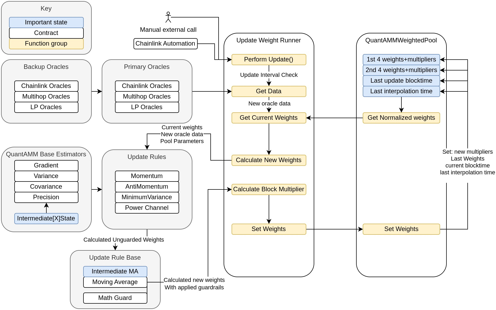

# What is QuantAMM?

QuantAMMis a novel DEX that runs a variant of Constant Function Market Making (CFMM)–Temporal Function Market Making (TFMM). Within any given block QuantAMMWeightedPools pools are generic Balancer-style AMM pools run on Balancer v3 infrastructure, but the vector of weights of the pool (the allocation of value between pool constituents) change between blocks in accordance with a specified “update rule” Arbitrageurs act, just as in vanilla DEX pools, trading so as to bring each pools' holdings into alignment with its vector of weights. The rules for changing weights act as strategies, and good strategies can lead to performance that more than makes up for the rebalancing cost paid to arbitrageurs. (To be clear, capital is at risk.) Oracles are called to provide the information (commonly, market prices) needed for an update rule to operate.
What is novel in QuantAMM?

1. Novel gradient, variance, covariance estimators: Update rules often reuse various mathematical primitives, which we provide as useful lego-bricks. These are designed for both gas efficiency and for performance in giving signals for update rule to make use of. One example is a statistically-motivated gradient estimator–knowing how a price has changed is very important information, but naive on-chain approaches have poor performance. The provided estimators require little storage and can be configured with a temporal “memory” of a desired length.

2. Viable with only arbitrageurs: As the protocol is designed for pool that give capital gain uplift to LPs, rather than relying on swap fee revenue, we can work off toxic flow only. This allows core features that are institution-friendly, such as compliance hooks, that are unpalatable to vanilla DEXs that always are trying to increase retail trading volume.

3. Continuous Temporal Function Market Making: Not having fixed target weight has certain benefits. For trend-following strategies, the worst thing to do is to go ‘the wrong way', and the second-worst thing to do is to stop. As a failsafe, Temporal Function Market Making allows for continuous weight changes, so instead of stoping when a preset target weight is reached the weight changes continue in the calculated direction until some form of 'guardrail' is reached (see “Is there MEV protection?” below).

# How are the weight at a given block determined?

An Update Rule is called at a chosen frequency, say every day. It queries oracles and performs calculations to give a weight change at that time-scale, which is then scaled to become a ‘per block’ change in weights.

The simples thing to go then is to linearly interpolate up to that value over a given period of time, so the weight at any given block is: 

‘Previous fixed weight’ + [('current block timestamp' – ‘block timestamp at which that previous weight was fixed')*'weight multiplier per block unit']

# Is there MEV protection?

Weight changes are, in theory, front-runnable, though this is intrinsically a multi-block attack. In analogy with how trades have to be above a certain threshold to be able to be front-run on some platforms, here the weight changes have be to be 'big enough'. There are three types of guard rails that provide MEV protection:

1. Absolute weight guardrail. A single asset weight cannot go below that guard rail or above  - that guard rail. 

2. Dynamic weight change guardrail. Weights between blocks can only change up to a ‘speed limit’ amount even if the update rule is telling it to change faster. 

3. Proportional trade size per pool. A pool cannot change its reserves beyond a configured % per operation (trade, block trade, single asset deposit/withdrawal)

The combination of these guardrail provide multi-block MEV protection.

# What is the general protocol design?

QuantAMM is built on Balancer v3 architecture. Inheriting the base weighted pool design but with a custom invariant that takes into account interblock changes. 

Two part protocol

The protocol design is split in two core contracts:

1. Update Weight Runner – Responsible for the inter-block weight update rule process. This has one entry point of “Perform Update” whose output is to save new “previous fixed weight” and “weight multiplier per block unit” to the QuantAMM Base Pool

1. QuantAMMWeightedPool – responsible for all reserves and trading. Any deposit/withdraw functionality is inherited from balancer v3 here. 

There are auxiliary contracts which are used, these can be grouped by:

- QuantAMM Based Estimators – these are the generic building blocks containing the novel estimators and the intermediate state per pool required for those calculations

- Rules – Inheriting a base class that maintains moving averages, these rules are responsible for the use of the “QuantAMMBased[]” estimators into applicable strategies

- QuantAMM Storage – storage functions encapsulated to pack and unpack variables into more efficient SSTOREs. 

- Oracles – There are standard oracle wrappers, however there are two kinds of bespoke oracles: 

    - LPOracles – get the underlying value of the base pool, this is an example of a composite pool oracle. In theory other composite pool oracles based on other factors such as risk variables can be created

    - Multi-hop oracles – it might be that there isn’t a desired oracle that takes you from A->B, multihop oracles abstract the multihop logic away from the update weight runner into a wrapped oracle. 

- Routers – There are two pool types

    - Creator pools – these have specific, per deposit, charged-on-uplift-only withdrawal fees, so LP tokens are NFTs.

    - index pools – more standard pools that have simpler fee structures and so have ERC20 LP tokens.

# Oracle use in QuantAMM

Oracles are used in the core of QuantAMM. Traditionally use of oracles in DEXs has been vulnerable to oracle manipulation attacks, each QuantAMMuse of oracles provides some protection against this. There are multiple areas of use of oracles:

1. Update weight runner, update rule functionality – oracles are used as the signal for rules to run. As we smooth oracle values over time, you would need to have a sustained oracle attack for hours or days for a significant effect. Also these smoothed moving averages can also be used instead of current price in the rules, allowing a second layer of smoothing. Long memories (high lambda parameters) combined with moving-average smoothing have proven to be the most alpha generating in standard QuantAMMstrategies. 

1. Uplift based fees – given specified DAO controlled oracles to USD on deposit we record the USD value of an LP token. On withdrawal for creator pools we record the new USD value of the LP token and a withdrawal based fee is taken based on how long you have LP’d (the longer you LP the smaller proportion of fee is taken) and the uplift generated. If the pool has not made any uplift then only the withdrawal amount needed for defence against deposit/withdraw attacks is taken. 

# Storing weights and their multipliers

For calculations an 18dp maths library is used. Does storing weights and multipliers at 18dp have benefits for running of the pool? Already given that weights are below 0, int128 will give us the neccessary 18dp required allowing for one constituent to be stored in one slot. 

Simulations show no difference with storing at 9dp during a market bull/bear run cycle
momentum.

This means we can pack at a 9dp resolution with little to no impact on pool performance. this means that we can now pack 8 units in 1 int256 slot. That is 4 constituents and their multipliers in one slot. 

Packing like this has one small draw back. Retrieval is more efficient as an all or nothing thing. Getting individual weights is not basic but given the use cases 90% of the time we will be getting all the weights anyway. 

# Update weight runner

The update weight runner really performs the coordination of weight updates while only performing DR and final setting functions. It is intended to be a singleton deployment that is recorded in the DAO to allow certain functionality to only be called by the QuantAMM Base Pool and vice versa. 

## Setting rules

Called during the creation of a pool setRuleForPool sets up all the cache values to run a particular pool and a particular strategy. This could allow running of a pool without the trading being enabled for a pool allowing for provisional assessment and parallel running of a pool in production. 

## Calling updates

Checks are performed in whether or not the update interval has been reached. this then triggers an update. : 

- Get the oracle data required from either normal oracles, multihop oracles or LPOracles

- Pass that data to the updaterule.CalculateNewWeights(…) function

## Getting oracle data

There are two caches of oracles, optimised and non optimised. Optimised is solely storing happy path first choice oracles for a rule/pool combo. The reason why this is split from the backups is efficiency. Accessing this single array reduced a large number of SLOADs from multidimensional array access. 

A basic oracle wrapper is provided and we expect others will come along and make derived oracle wrapper classes. Use of those oracles is gated by a registration process so that some rogue oracle is not introduced. 

## Rule structure and calling

A base class for update rule provides an updaterule.CalculateNewWeights(…) function that keeps the core requirements of guards and moving averages in a centralized place while allowing individual rules to override the getweights function. 

The QuantAMMBased classes storing the intermediates allows or an inheritance structure that preserves key areas of code in centralised places. 

The int256s used are converted to 18dp using the PRBMath lib.

## Guard Rail process

There are two main guard rails:

1. Firstly a maximum buffer from 0 and 100% weights is applied. This is configurable per pool

1. A “speed limit” is applied where during one interval window a max weight change is applied. This has dual purpose of execution efficiency and MEV protection

The guard rails are in the base update rule class and functions are always called to provide consistency. 

## Determining multipliers and getting weights

A linear multiplier will always be stored from the update weight runner and the QuantAMM Base Pool. Later there is possibility in the QuantAMM Base Pool to provide a more advanced feature where the linear multiplier is shifted according to more sophisticated randomization or geometric interpolation. 

While the logic to determine the multiplier is simple give the block interval and change in weight, specific logic is needed to find the block.timestamp which the first constituent will hit a guard rail. Continuing along the linear interpolation path is fine given the guard rails however once a guard rail is hit more complex logic would be needed so we freeze at that weight. 

## Economic reason to keep interpolating

Why is this desirable? To be clear there are multiple levels of redundancy that should make this a non issue for triggering the update rule however in the case that an update is not called and there is a strong signal to rebalance, the worst thing you can do is shift weights against that signal – at least according to the rule – and the second worst thing to do is to stop. So carrying on should reduce any impermanent loss or actually continue generating alpha. 

What would it take for this to not be the case? The signal would need to reverse. Give the smoothing and the lambda ranges being in the days and weeks, as well as the update intervals currently being in the hours, it would take a considerable sustained signal change for this to be the case. Even if it is the case given the update intervals it would probably take even longer for that to be reflected in normal running of the pools. 

Hopefully by that time an update would be triggered or another update interval reached.

## Pool Creation

Pools are created via their respective factory methods that ensure parameter requirements are met. SetRuleForPool is called during construction of the pool however registration into the UpdateWeightRunner is Protocol controlled. 

## Index pools hooks

Indices are great and simple. They usually want to track a given signal and their exposure should closely match it. Often protocols have attempted to create index trackers by trading themselves. This means we can take a much larger chunk of the swap fees and the product will still serve it’s purpose. The LP tokens should also be ERC20 compliant producing all the right events etc. The balance of the ERC20 LP is the central vault reserves given override functions in the token contract.

Fixed fees are needed as strictly speaking if there is differentiation in fees between deposits the ERC20 tokens will not be worth the same value and will not be fungible. This creates a potential downside of this model as fixed fees on total withdrawal could be large or proportionally larger compared to uplift only fees. 

## Creator pools hooks

Creator pools provide a fee structure that mainly comprises of an uplift only model. Each deposit tracks it’s LP token value in a base currency. On withdrawal any uplift since deposit will be the subject of the fee. This should be attractive to LPs as if the pool has not had any uplift the minimum required fee to prevent withdrawal / deposit attacks is changed. 

The uplift is calculated as: base + (x / ”time since deposit” ^ y). If the uplift comes within a small % of the base the fee reverts to the base for simplicity. 

If you have multiple deposits into a pool how is a big or partial withdrawal handled? A FIFO mechanism is applied draining earlier deposits of balance, again this should be attractive as the stickier the LP the less fees are taken. If a deposit is fully drained then it can be deleted leading to a little gas benefit during the withdrawal. 

 